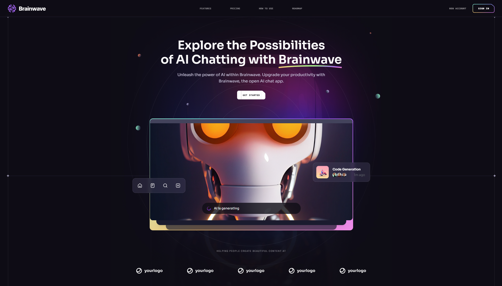
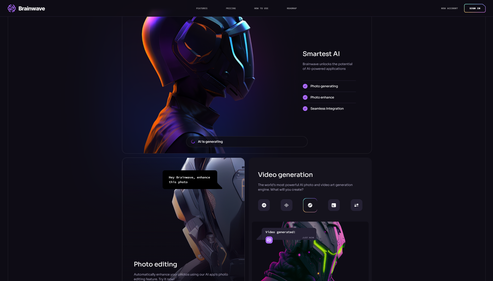

# 🎨 Frontend Portfolio React Landing Page - Brainwave 🧠

## 📝 Implementation in React and Tailwind, using Vite of a Landing Page for a fictional company named Brainwave

This is an implementation of the Brainwave Landing Page design made by [Adrian Hajdin](https://github.com/adrianhajdin/brainwave). This implementation was made by me for portfolio reasons. I don't own nor clame any rights over the design idea.

## ⚙ Stack

## 🧪 Test it out

Use the following link to github pages: [Brainwave LP](/)

## 👨‍💻 Run the project at your own environment

To run the project at your own environment

1. Install [Node and npm](https://nodejs.org/en/download)
2. Clone or download the files from this repository
3. Run `npm install` on the terminal
4. Then run `npm run dev`
5. Open the project through the generated link

## 📢 Any suggestions?

If you have any ideas or bugs o report, feel free to submit an issue on the issues tab up above!

## ✅❎ Work in progress

- [ ] Upgrade Tailwind from V3 to V4
- [ ] Implement other pages
- [ ] UI animations
- [ ] Backend for accounts
